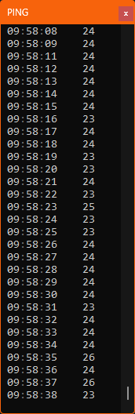

# Windows Ping Utility

  

   

  

A lightweight, high-performance C++ utility designed for persistent network monitoring. This tool features a minimalist interface, automatic window management, and buffered logging to minimize system impact.

---

## Key Features

* **Window Persistence**: Automatically saves and restores the window's screen position and size ($X, Y, W, H$) between sessions.
* **Stealth Mode**: Automatically hides from the taskbar using `WS_EX_TOOLWINDOW` to reduce desktop clutter.
* **Visual Latency Alerts**:
    * **White**: Standard latency.
    * **Yellow**: High latency (threshold configurable in `.ini`).
    * **Red**: Request Timed Out (RTO) or DNS Resolve Errors.
* **Efficient Logging**: Buffers log entries in memory and writes them in batches to the disk to prevent micro-stutters and reduce I/O overhead.
* **Single Instance Protection**: Uses a Windows Mutex to ensure only one instance of the monitor runs at a time.
* **Auto-Conhost**: Detects if launched outside of a standard console and wraps itself in `conhost.exe` for better compatibility.

---

## Configuration (`settings.ini`)

The program generates a `settings.ini` file on its first run. You can customize the behavior by editing these values:

### [Network]
| Key | Default | Description |
| :--- | :--- | :--- |
| `IP` | `1.1.1.1` | Target destination (IP or Hostname). |
| `delay` | `1000` | Milliseconds between each ping request. |
| `warning` | `50` | The threshold in ms where text turns **Yellow**. |

### [Logging]
| Key | Default | Description |
| :--- | :--- | :--- |
| `enabled` | `false` | Set to `true` to enable saving to the `/logs/` folder. |
| `log_interval` | `30` | Number of pings to collect before writing to file. |

### [Window]
| Key | Description |
| :--- | :--- |
| `X`, `Y` | Screen coordinates for the top-left corner. |
| `W`, `H` | Width and Height of the console window. |

---

## Technical Architecture

This utility is built using the **Windows ICMP API** rather than raw sockets, allowing it to run without administrative privileges in most environments.

* **Language**: C++17 or higher
* **IDE**: Visual Studio 2022
* **Libraries**: 
    * `Iphlpapi.lib` (ICMP Send/Receive)
    * `Ws2_32.lib` (Socket and Hostname resolution)
    * `User32.lib` (Window management)

---

## Build Instructions

1.  Open the project in **Visual Studio 2022**.
2.  Ensure the configuration is set to **Release** and your target architecture (e.g., **x64**).
3.  The project is pre-configured with `#pragma comment` directives, so no manual linker adjustment is required.
4.  Build Solution (`Ctrl + Shift + B`).

## How to Close
The application listens for the `CTRL_CLOSE_EVENT`. To ensure your window position and logs are saved correctly, close the application by:
* Clicking the **X** button.
* Pressing **Alt + F4**.

---

## License
---

## License
See the [LICENSE](LICENSE) file for the full text.
